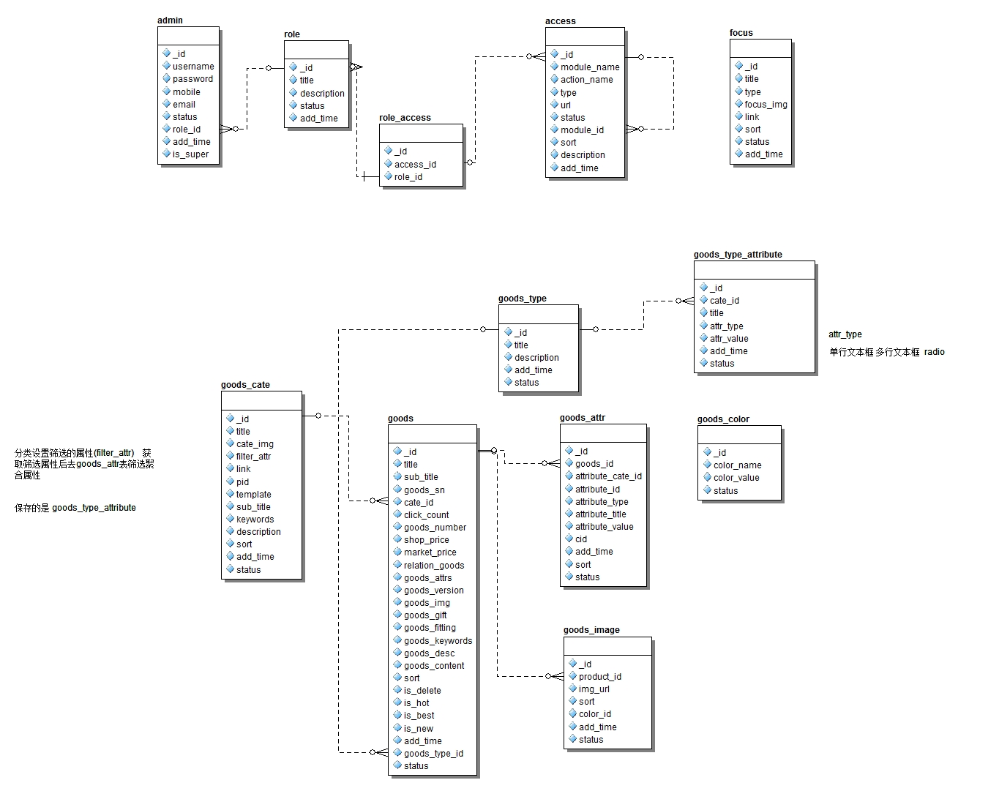

# node-egg-shop

## 项目结构

- 后台管理系统

- 前端页面展示

- API提供

- 其他服务

## 用户RBAC权限管理

- 基于角色的权限访问控制(Role-Based Access Control)。在 RBAC 中，权限与角色相关联，用户通过成为适当角色的成员而得到这些角色的权限。这就极大地简化了权限的管理。

- RBAC 实现流程
    * 1、实现角色的增、删、改、查 
    * 2、实现用户的增、删、改、查，增加修改用户的时候需要选择角色 
    * 3、实现权限的增、删、改、查 (页面菜单) 
    * 4、实现角色授权功能 
    * 5、判断当前登录的用户是否有访问菜单的权限 
    * 6、根据当前登录账户的角色信息动态显示左侧菜单

- 用户RBAC权限管理
    * 用户管理
        * 用户列表
        * 添加用户
        * 编辑用户
        * 设置角色
    * 角色管理
        * 角色列表
        * 添加角色
        * 编辑角色
        * 设置权限
    * 权限管理
        * 权限列表
        * 添加权限
        * 编辑权限
        * 也就是保存了用户所有的模块(用户管理、角色管理、权限管理)，菜单和操作(删除、修改)

### 权限控制相关的数据库表

<div align="center">
    
</div>

- admin
    * _id
    * username
    * password
    * mobile
    * email
    * status
    * role_id
    * add_time
    * is_super
- role
    * _id
    * title
    * description
    * status
    * add_time
- role_access
    * _id
    * access_id
    * role_id
- access
    * _id
    * module_name
    * action_name
    * type
    * url
    * status
    * module_id
    * sort
    * description
    * add_time

### 商城前台

**商品模块实现流程**

- 实现商品类型的增删改查
- 实现商品类型属性的增删改查，并实现类型和类型对应属性的关联
- 实现商品分类的增删改查，并实现商品分类表的自关联
- 实现商品模块的增删改查、并且实现商品和商品分类、商品类型、颜色等其他表的关联

**商品模块相关的数据库表ER图**

<div align="center">
    
</div>

### 关于分页的问题

**数据库分页查询数据的原理算法**

规则：规定每页 20 条数据的查询方式
查询第一页（page=1）:
db.表名.find().skip(0).limit(20)
查询第二页（page=2）:
db.表名.find().skip(20).limit(20)
查询第三页（page=3）:
db.表名.find().skip(40).limit(20)

规则：规定每页 8 条数据的查询方式
查询第一页（page=1）:
db.表名.find().skip(0).limit(8)

查询第二页（page=2）:
db.表名.find().skip(8).limit(8)
查询第三页（page=3）:
db.表名.find().skip(16).limit(8)
查询第四页（page=4）:
db.表名.find().skip(24).limit(8)

总结：分页查询的 sql 语句
db.表名.find().skip((page-1)*pageSize).limit(pageSize)

**Mongoose 实现分页的方法**

地址：https://mongoosejs.com/docs/queries.html

```js
Person. find({
occupation: /host/,
'name.last': 'Ghost',
age: { $gt: 17, $lt: 66 },
likes: { $in: ['vaporizing', 'talking'] }
}).
limit(10). sort({ occupation: -1 }). select({ name: 1, occupation: 1 }). exec(callback);

// Using query builder
Person. find({ occupation: /host/ }). where('name.last').equals('Ghost'). where('age').gt(17).lt(66). where('likes').in(['vaporizing', 'talking']).
limit(10). sort('-occupation'). select('name occupation'). exec(callback);
```

**数据结合 jqPaginator 实现分页**

插件文档：http://jqpaginator.keenwon.com/

### 前台用户注册流程

- 填入手机号，图形验证码，进行前置校验程序
- 发送验证码，手机获取的验证码和服务器验证码做比较，成功则进入下一步，否则提示错误信息
- 设置账户密码，服务器端生成一条用户数据

### 支付相关

**微信**


**支付宝**

- 接入支付宝
    * 必须注册企业支付宝账户
    * 支付宝开发接入页面：https://open.alipay.com/developmentAccess/developmentAccess.html
    * 点击支付应用
    * 填写对应应用名称, 点击创建
    * 创建以后进入概览页面, 上传应用图标
    * 设置应用公钥，提交审核
- 接口加密签名
    * 下载签名工具：https://opendocs.alipay.com/open/291/106097/
    * 选择非Java(java语言还是选择java适用)，点击生成密钥，会生成两个：商户应用私钥，商户应用公钥
    * 复制应用公钥，在支付宝后台开发设置中 设置应用公钥 粘贴进去，保存后会生成一个支付宝公钥
    * 签名。并保存好私钥、公钥
- 配置签名 提交审核
    * 审核周期为1天
- 官方支付流程
    * 官方支付流程文档：https://docs.open.alipay.com/203/107084/
- 支付宝支付官方文档
    * https://docs.open.alipay.com/270/105899/
- Nodejs 支付宝支付实现步骤
    * 1、登录支付宝开放平台 获取应用 APPID、获取支付宝公钥、以及 RSA 签名的应用私钥
        * 注意：RSA 签名验签工具可以生成应用私钥和应用公钥，我们在支付宝开放平台填写应用公钥生成支付宝公钥
    * 2、调用 nodejs 支付宝支付 sdk 实现支付
        * Nodejs Aliapy Sdk 文档：https://github.com/Luncher/alipay
    * 3、 Aliapy Sdk 的使用：
        * 安装模块 npm i alipay-mobile -S
        * 引入模块 const Alipay = require('alipay-mobile')
        * 配置开放平台 appid、 你的应用私钥、蚂蚁金服支付宝公钥 
            * const options = {app_id: '', appPrivKeyFile: "应用私钥", alipayPubKeyFile: "支付宝公钥"}
        * 实例化 Alipay const service = new Alipay(options);
        * 配置支付订单的信息、以及配置支付参数
        * 生成支付宝支付跳转地址
        * 处理异步通知

## QuickStart

<!-- add docs here for user -->

see [egg docs][egg] for more detail.

### Development

```bash
$ npm i
$ npm run dev
$ open http://localhost:7001/
```

### Deploy

```bash
$ npm start
$ npm stop
```

### npm scripts

- Use `npm run lint` to check code style.
- Use `npm test` to run unit test.
- Use `npm run autod` to auto detect dependencies upgrade, see [autod](https://www.npmjs.com/package/autod) for more detail.


[egg]: https://eggjs.org